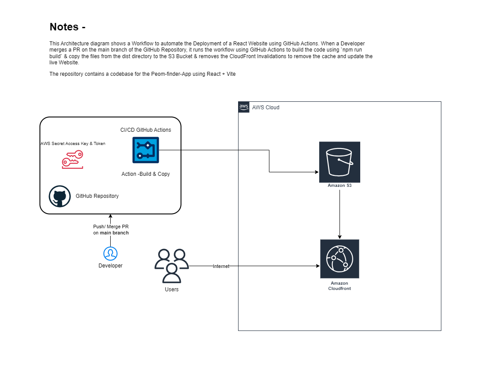

# React-Poem-Finder-App

### Quick Start
```sh
git clone https://github.com/jivaniyash/react-poem-finder-app.git
cd react-poem-finder-app
npm install
npm run dev
```

## Table of Contents

- [Overview](#overview)
  - [Features](#features)
- [Getting Started](#getting-started)
  - [Prerequisites](#prerequisites)
  - [Installation](#installation)
- [Usage](#usage)
  - [Deployment](#deployment)

## Overview
This Project is built using React + Vite Application. It helps users to find & search poems quickly by typing keywords in the search bar. 
Check Out [Project](https://dgmca1q0tkf1c.cloudfront.net) at CloudFront Link.


### Features
1. *Overlays* - are used to show/hide the metadata of the poem
2. *Search Bar* - to filter the Poems by title/content, sorted by Ascending Order & by title first (Searchable across EN & GU language)
3. *Pagination* - to change the display of poems in a single page & Page Navigation at the bottom of the Screen
4. *Language* - toggle to change the default global language and poem-level toggle
5. *Highlighter* - to show the query search in the poem

## Getting Started

### Prerequisites

- git
- Node.js (18 or later)
- npm
- Vite (`npm install -g vite`)
- AWS Account (with sufficient permissions to create & add files to a S3 Bucket)

### Installation

1. Clone the Repository
    ```sh
    git clone https://github.com/jivaniyash/react-poem-finder-app.git
    ```

2. Navigate to the project directory:
    ```sh
    cd react-poem-finder-app
    ```

3. Install dependencies
    ```sh
    npm install
    ```

4. Test in Local Machine
    ```sh
    npm run dev
    ```
    This will start the App @ `http://localhost:5173`. You can remove the [configuration](vite.config.js) - `host: true` from the server parameter to disable access from other users on the same network 

5. Build the App
    ```sh
    npm run build
    ```
    This will generate a new `dist` directory at the root level. 

6. Preview Production Build Locally
    ```sh
    npm run preview
    ```
    This will start the App @ `http://localhost:4173`

## Usage



There are 2 options to deploy the React App - either using S3 website endpoint or by Cloudfront by securing the connection.

### Deploy App in AWS S3 Bucket and access via S3 public link
1. Create an S3 Bucket with uncheck Block all public access option to allow Public Access 
2. Once Bucket is created, navigate to the Properties tab & Enable Static website hosting 
3. Specify the default page of the website -`index.html` 
4. Upload all the contents from the `dist` directory to the S3 Bucket
5. Open the Bucket website endpoint - `http://bucket-name.s3-website-region.amazonaws.com/`

### Deploy App in AWS S3 Bucket and access via AWS CloudFront
1. Create an S3 Bucket with `Block all public access option`
2. To configure a secure HTTPS connection, create a CloudFront distribution, configuring the domain from the S3 Bucket
3. Select Origin access control(OAC) settings & create OAC to allow Bucket access for CloudFront
4. Set `Redirect HTTP to HTTPS` & optional caching and domain settings
5. Set the *root object* as `index.html`
6. Copy & Paste the Policy of the OAC to S3 Bucket
7. Open the CloudFront Website Endpoint - https://id.cloudfront.net/

### Deployment
- AWS Deployment using [deploy.yml](.github/workflows/deploy.yml)
1. Create Access keys & Access Token from IAM User Console
2. Open GitHub Repository Settings -> Under Security -> secrets and variables -> Actions -> Repository secrets
- Add `AWS_ACCESS_KEY_ID`
- Add `AWS_SECRET_ACCESS_KEY`
- Add `S3_BUCKET_NAME`
- Add `CLOUDFRONT_DISTRIBUTION_ID` # if App is deployed to cloudfront for removing cache
3. Change GitHub Repository `Code and automation` Settings -> Branches
- Add a Branch protection rule to allow the deploy.yml file run when a new changes are pulled from a feature branch using Pull Requests.

## Steps for Fresh Start
1. Run the following commands for a fresh start of the Project 
    ```sh
    npm create vite@latest my-project -- --template react
    cd my-project                 
    npm install
    npm run dev
    ```

2. Customize the directory and files to add/alter/remove the files for a particular use case